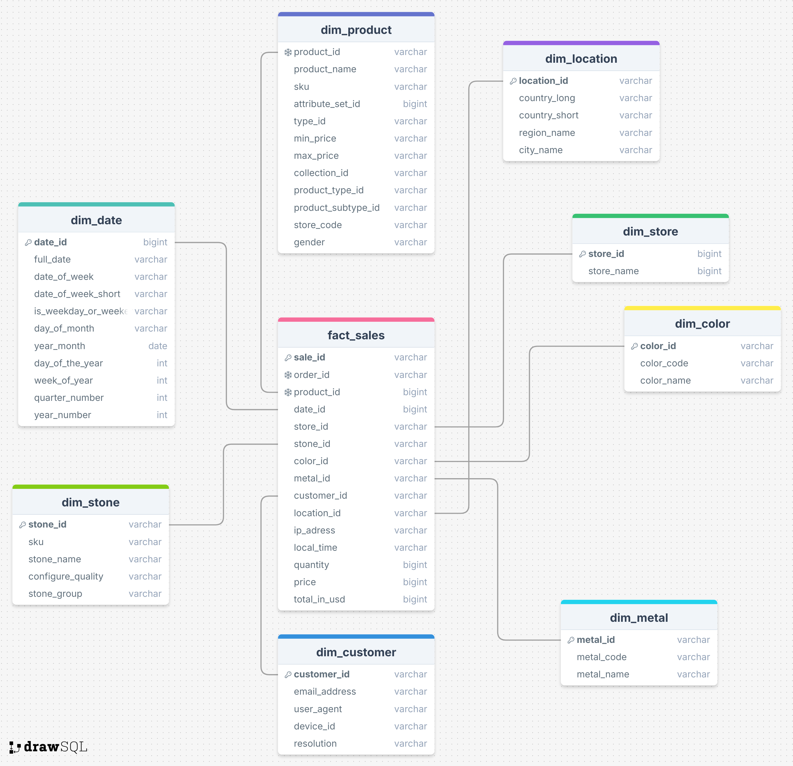

# Realtime Glamira E-commerce Analytics Pipeline Project

# Table of Contents
- [Realtime Glamira E-commerce Analytics Pipeline Project](#realtime-glamira-e-commerce-analytics-pipeline-project)
- [Table of Contents](#table-of-contents)
  - [❓ Problem Description](#-problem-description)
    - [Overview](#overview)
    - [Data Description](#data-description)
  - [📋 Star Schema Data Warehouse the Kimball Data Warehouse approach](#-star-schema-data-warehouse-the-kimball-data-warehouse-approach)
  - [📂 Project Structure](#-project-structure)
  - [⚙️ Preparation for project](#️-preparation-for-project)
    - [Step 1: Install Hadoop](#step-1-install-hadoop)
    - [Step 2: Install Spark](#step-2-install-spark)
    - [Step 3: Install Kafka](#step-3-install-kafka)
    - [Step 3: Install Postgresql](#step-3-install-postgresql)
    - [Step 4: Initialize the Database](#step-4-initialize-the-database)
    - [Step 5: Install dependencies](#step-5-install-dependencies)
    - [Step 6: Initialize .env file from the root folder](#step-6-initialize-env-file-from-the-root-folder)
    - [Step 7: Initialize logs folder from the root folder](#step-7-initialize-logs-folder-from-the-root-folder)
    - [Step 8: Initialize config file for kafka streaming](#step-8-initialize-config-file-for-kafka-streaming)
    - [Step 7: Put BIN IP2LOC file to HDFS for spark job](#step-7-put-bin-ip2loc-file-to-hdfs-for-spark-job)
  - [📝 How to run](#-how-to-run)
    - [Step 0: Install required dependencies](#step-0-install-required-dependencies)
    - [Step 1: Run the Kafka consumer](#step-1-run-the-kafka-consumer)
    - [Step 2: Submit the Spark Streaming Job](#step-2-submit-the-spark-streaming-job)
    - [Step 3: Run and view the Realtime Dashboard](#step-3-run-and-view-the-realtime-dashboard)
  - [Monitor Database](#monitor-database)
  - [Stop the program](#stop-the-program)

## ❓ Problem Description
### Overview
This problem solves the integration of `Kafka` and `Spark` by utilizing `Spark` to consume data from `Kafka`, then performing processing and calculations, and stores the results into a `PostgreSQL` database.

### Data Description
**Input:**

- **Kafka:** A local `Kafka` cluster where a `topic` contains user behavior data on a website ( logs).
- **Spark:** A local `Spark` cluster installed via Docker.
- **Data Schema:** Unstructured or semi-structured JSON logs.
- **Input Schema:**

| Name         | Data Types    | Description                                             | Examples                                                                                                                                                            |
|--------------|---------------|---------------------------------------------------------|---------------------------------------------------------------------------------------------------------------------------------------------------------------------|
| id           | String        | Log id                                                  | aea4b823-c5c6-485e-8b3b-6182a7c4ecce                                                                                                                                |
| api_version  | String        | Version api                                             | 1.0                                                                                                                                                                 | 
| collection   | String        | Log types                                               | view_product_detail                                                                                                                                                 | 
| current_url  | String        | The URL of the website the user is currently visiting                | https://www.glamira.cl/glamira-anillo-saphira-skug100335.html?alloy=white-375&diamond=sapphire&stone2=diamond-Brillant&itm_source=recommendation&itm_medium=sorting |
| device_id    | String        | Device ID                                               | 874db849-68a6-4e99-bcac-fb6334d0ec80                                                                                                                                |
| email        | String        | User Email                                              |                                                                                                                                                                     |
| ip           | String        | IP address                                              | 190.163.166.122                                                                                                                                                     |
| local_time   | String        | Log creation time. Format dạng yyyy-MM-dd HH:mm:ss | 2024-05-28 08:31:22                                                                                                                                                 |
| option       | Array Object  | List of product options                                 | `[{"option_id": "328026", "option_label": "diamond"}]`                                                                                                              |
| product_id   | String        | Product ID                                              | 96672                                                                                                                                                               |
| referrer_url | String        | The web link leads to the link `current_url`                | https://www.google.com/                                                                                                                                             |
| store_id     | String        | Store ID                                                | 85                                                                                                                                                                  |
| time_stamp   | Long          | Timestamp of the time the log record was created               |                                                                                                                                                                     |
| user_agent   | String        | Browser and device information                          | Mozilla/5.0 (iPhone; CPU iPhone OS 13_4_1 like Mac OS X) AppleWebKit/605.1.15 (KHTML, like Gecko) Version/13.1 Mobile/15E148 Safari/604.1                           |

**Output:**
- **Data Warehouse:** A Star Schema in `PostgreSQL` including:
    - **Fact Table:** `fact_product_views`
    - **Dimension Table:** `dim_product`, `dim_store`, `dim_location`, `dim_customer`, `dim_date`


**Real-time Dashboard:** A Streamlit interface visualizing key metrics:
    - Top 10 products with the highest views in the current day.
    - Top 10 countries with the highest views in the current day (based on IP to location).
    - Top 5 referrer URLs with the highest views in the current day.
    - For any given country, retrieve a list of `store_id` and their corresponding views, sort by view count in descending order.
    - Hourly view data for any given `product_id` during the day.
    - Hourly view data for each browser and OS.

## 📋 Star Schema Data Warehouse the Kimball Data Warehouse approach


## 📂 Project Structure
```text
├───.venv
├───build
├───environment
├───hadoop-conf
├───img
├───logs
└───src
    ├───kafka_to_kafka
    ├───logs
    └───streaming
```

## ⚙️ Preparation for project
### Step 1: Install Hadoop
- Stand at [Hadoop Folder](./build/hadoop/)
- See the instruction in [Hadoop Installing](./build/hadoop/README.md)

### Step 2: Install Spark 
- Stand at [Spark Folder](./build/spark)
- See the instruction in [Spark Installing](./build/spark/README.md)

### Step 3: Install Kafka 
- Stand at [Kafka Folder](./build/kafka)
- See the instruction in [Kafka Installing](./build/kafka/README.md)

### Step 3: Install Postgresql 
- Stand at [Postgresql Folder](./build/kafka)
- See the instruction in [Postgresql Installing](./build/kafka/README.md)

### Step 4: Initialize the Database
- Execute the SQL script to create Fact table and Dimension tables in PostgreSQL.
- Run the script below:
```bash
cat ./src/db_schema.sql | docker exec -i postgres psql -U postgres -d postgres
```

### Step 5: Install dependencies
```bash
pip install -r requirements.txt
```

### Step 6: Initialize .env file from the root folder
Example of .env file
```
"spark.app.name"=KafkaStreaming
KAFKA_BOOTSTRAP_SERVERS=localhost:9094,localhost:9194,localhost:9294
KAFKA_SECURITY_PROTOCOL=SASL_PLAINTEXT
KAFKA_SASL_MECHANISM=PLAIN
KAFKA_SASL_JAAS_CONFIG='org.apache.kafka.common.security.plain.PlainLoginModule required username="username" password="password";'
KAFKA_TOPIC=local_product_view
KAFKA_USER=admin
KAFKA_PASS=admin
PG_HOST=postgres
PG_PORT=5432
PG_HOST_TO_DOCKER=localhost
PG_PORT_TO_DOCKER=5433
PG_DB=postgres
PG_USER=postgres
PG_PASSWORD=admin
LOGGING_LEVEL=INFO
LOGGING_FILE=logs/kafka_log.log
LOGGING_TO_CONSOLE=true
```

### Step 7: Initialize logs folder from the root folder
- Create folder named logs including kafka_log.log and streaming.log

### Step 8: Initialize config file for kafka streaming
- Create folder named environment including config.yml
- Example:
```
LOCAL_BOOTSTRAP_SERVERS: ["localhost:9094", "localhost:9194", "localhost:9294"]
SOURCE_BOOTSTRAP_SERVERS: ["HOST_1:POST_1", "HOST_2:POST_2", "HOST_3:POST_3"]
KAFKA_TOPIC: "product_view"
LOCAL_KAFKA_TOPIC: "local_product_view"
SECURITY_PROTOCOL: "SASL_PLAINTEXT"
SASL_MECHANISM: "PLAIN"
SASL_PLAIN_USERNAME_LOCAL: "admin"
SASL_PLAIN_PASSWORD_LOCAL: "admin"
SASL_PLAIN_USERNAME: "admin"
SASL_PLAIN_PASSWORD: "admin"
```

### Step 7: Put BIN IP2LOC file to HDFS for spark job
- In the root folder of the project, create folder resources and data
  ```bash
    mkdir resources/data
  ```
- Put BIN file into data folder 
- Run the following bash to put BIN file to HDFS
  ```bash
    // COPY file into hadoop 
    docker cp ./resources/data/IP-COUNTRY-REGION-CITY.BIN \
    hadoop-namenode-1:/tmp/IP-COUNTRY-REGION-CITY.BIN

    // PUT to HDFS
    docker exec -ti hadoop-namenode-1 bash -c \
    'hdfs dfs -put /tmp/IP-COUNTRY-REGION-CITY.BIN /user/spark/'

    // CHECK FILE EXIST
    docker exec -ti hadoop-namenode-1 bash -c 'hdfs dfs -ls /user/spark'
  ```

## 📝 How to run
### Step 0: Install required dependencies
- Run the following bash to install: 
```bash
python3 -m venv .venv

source .venv/bin/activate

pip install -r requirements.txt
```
### Step 1: Run the Kafka consumer 
- In a terminal, move to the root folder of the project
- Run the following terminal command line:
```shell
source ./venv/bin/activate
```

```shell
python -m src.kafka_to_kafka
```

### Step 2: Submit the Spark Streaming Job 
- In another terminal, move to the root folder of the project 
- The flow including reading log messages from Kafka, performing ETL, enriching IP2locations, and writes to Postgresql.
```shell
docker container stop kafka-streaming || true &&
docker container rm kafka-streaming || true &&
docker run -ti --name kafka-streaming \
--env-file ./.env \
--network=streaming-network \
-v ./:/spark \
-v ./hadoop-conf:/spark/hadoop-conf \
-v spark_lib:/home/spark/.ivy2 \
-v spark_data:/data \
-e HADOOP_CONF_DIR=/spark/hadoop-conf/ \
-e PYSPARK_DRIVER_PYTHON='python' \
-e PYSPARK_PYTHON='./environment/bin/python' \
-e KAFKA_BOOTSTRAP_SERVERS='kafka-0:9092,kafka-1:9192,kafka-2:9292' \
-e KAFKA_SASL_JAAS_CONFIG='org.apache.kafka.common.security.plain.PlainLoginModule required username="admin" password="@2025";' \
unigap/spark:3.5 bash -c "(cd /spark/src && zip -r /tmp/streaming.zip streaming) &&
conda env create --file /spark/environment.yml &&
source ~/miniconda3/bin/activate &&
conda activate pyspark_conda_env &&
conda pack -f -o pyspark_conda_env.tar.gz &&
spark-submit \
--files hdfs:///user/spark/IP-COUNTRY-REGION-CITY.BIN \
--packages org.apache.spark:spark-sql-kafka-0-10_2.12:3.5.1,org.postgresql:postgresql:42.7.2 \
--conf spark.yarn.dist.archives=pyspark_conda_env.tar.gz#environment \
--py-files /tmp/streaming.zip \
--deploy-mode client \
--master yarn \
/spark/src/__main__.py"
```

### Step 3: Run and view the Realtime Dashboard
- In a new terminal, run the visualization code
- Run the following bash for real time dashboard
```bash
streamlit run src/report_dashboard/report.py
```

**Output Example**: 
- [Report 1](./img/report_1.png)
- [Report 2](./img/report_2.png)
- [Report 3](./img/report_3.png)
## Monitor Database 
- Access the `adminer` address and enter the `postgres` information (See `environment` in [Docker Compose](./build/postgres/docker-compose.yml)).
- [adminer](http://localhost:8380)  
**Note:** `Adminer` is just a tool to connect to the database; we can use other tools such as `pgAdmin`, `DBeaver`, etc.

**Output Example**: 
- [Dimension and Fact tables](./img/)

## Stop the program
- Ctrl + C in all terminal to exit the program
- Run the following bash in each container to stop services and remove containers with their data:

```bash
docker compose down -v
```

- Run the following bash to stop services to stop services without deleting data:

```bash
docker compose down  
```